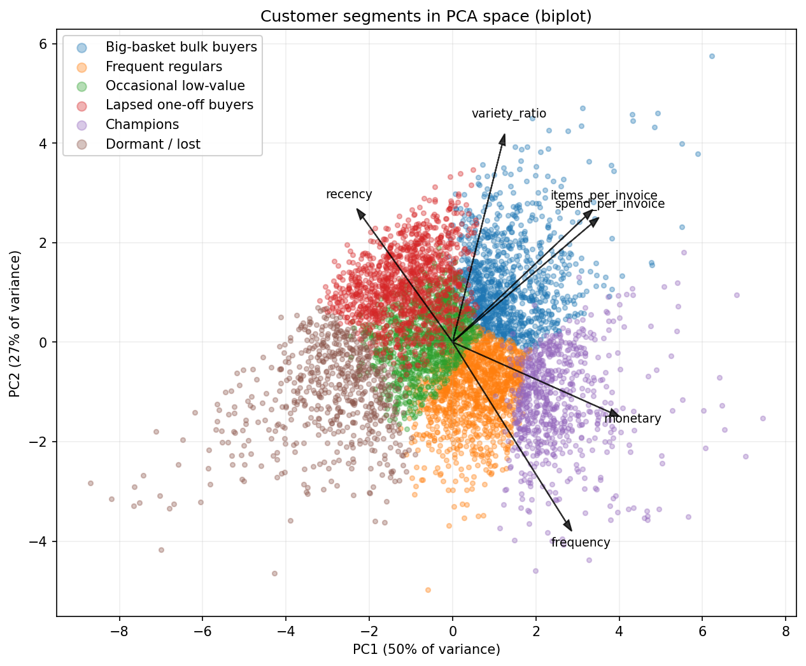

# Online Retail II — Customer Intelligence

Customer segmentation and market-basket analysis on two years of UK online retail
transactions (December 2009 to December 2011, ~1.07M rows). The project cleans the
raw data, profiles it, builds RFM features, segments customers with k-means, and
finds which products sell together.

Built as a set of small, reusable Python classes with one pipeline entry point, plus
notebooks that narrate each step.

## Findings

- **Revenue is highly concentrated.** The top 20% of customers account for **77%** of
  revenue. About **28%** of customers bought only once.

- **There are two kinds of wholesaler, not one.** Segmentation splits the high-value
  base into *Champions* (frequent, narrow-range, mostly UK reorderers; ~25 orders,
  ~£16k average spend) and *Big-basket bulk buyers* (occasional, wide-range, the most
  international group; huge mixed baskets). The variety ratio and items-per-invoice are
  what tell them apart.

- **Six customer segments**, from *Champions* down to *Dormant / lost*, laid out along a
  single value-and-activity axis. See the PCA biplot below.

- **Co-purchase falls into three patterns.** Collecting one product across colours
  (the red/blue/pink versions); completing a coordinated range (the Red Retrospot
  tableware — cup, plate, bowl, jug bought together, lift up to ~28); and occasion
  bundles (Vintage Christmas cake cases, napkins, and paper chains; the two vintage card
  games).

- **A seasonal one-and-done group.** A bump in recency around one year, plus the
  Christmas co-purchase rules, points to customers who buy once in the festive run-up
  and don't return — a retention opportunity.

## Key figures

| | |
|---|---|
| Revenue concentration (Pareto) | `results/eda/figures/customer_pareto.png` |
| Customer segments (PCA biplot) | `results/segmentation/figures/segments_pca.png` |
| Monthly revenue | `results/eda/figures/revenue_over_time.png` |
| Association rules | `results/basket/figures/rules_scatter.png` |



## Dataset

The "Online Retail II" dataset from the UCI Machine Learning Repository, mirrored on
[Kaggle](https://www.kaggle.com/datasets/mashlyn/online-retail-ii-uci). It is **not**
included in this repository (it's large and not mine to redistribute).

Download `online_retail_II.csv` and place it at:

```
kaggle_customer_intelligence/online_retail_II.csv
```

(or change the data path at the top of `main.py`).

## Running it

```bash
conda env create -f environment.yml
conda activate retail-customer-intelligence

python main.py
```

`main.py` runs the steps in order: clean → EDA → RFM → segmentation → basket. Each step
also runs on its own (`python retail_eda.py`, etc.) using the saved output of the
step before. Figures and tables are written under `results/` in per-step folders; the
cleaned data and feature tables are written to the data directory.

To explore the work step by step, open the notebooks in `notebooks/`.

## Method, in brief

- **Cleaning.** Drop exact duplicates, cancellations (invoices starting `C`) and
  accounting adjustments (`A`), non-positive quantities and prices, and non-product
  codes (postage, fees, gifts). Normalise product descriptions to one name per code.
  Full reasoning, with the numbers behind each rule, is in [NOTES.md](NOTES.md).

- **RFM.** Recency, frequency (distinct invoices), and monetary (gross spend) per
  customer, scored 1–5. Frequency uses fixed bins rather than quintiles because a
  quarter of customers share frequency = 1.

- **Segmentation.** k-means on six features (RFM plus spend-per-invoice,
  items-per-invoice, and a product-variety ratio), log-transformed where skewed and
  standardised. k = 6 chosen from the elbow and silhouette, then confirmed by how
  cleanly the clusters profile and name. PCA and UMAP plots visualise the result.

- **Basket analysis.** FP-Growth association rules over all valid invoices (anonymous
  baskets included), at 1% support, ranked by lift. Rules are categorised by whether
  the two sides are the same product, the same product type, or genuinely different.

## Project structure

```
.
├── README.md
├── NOTES.md                    # data quirks and why each cleaning rule exists
├── environment.yml             # conda environment (readable)
├── src/
│   ├── main.py                     # pipeline entry point
│   ├── retail_cleaner.py           # step 1: load and clean
│   ├── retail_eda.py               # step 2: exploratory analysis
│   ├── retail_rfm.py               # step 3: RFM features
│   ├── retail_segmentation.py      # step 4: k-means segmentation
│   └── retail_basket.py            # step 5: association rules
├── exploration/                # one-off diagnostics (not part of the pipeline)
│   ├── profile_data.py
│   ├── investigate_issues.py
├── notebooks/                 
│   ├── 01_cleaning.ipynb
│   ├── 02_eda.ipynb
│   ├── 03_rfm.ipynb
│   ├── 04_segmentation.ipynb
│   └── 05_basket.ipynb
├── results/                    # figures and tables from a run, per step
│   ├── eda/{figures,tables}/
│   ├── rfm/{figures,tables}/
│   ├── segmentation/{figures,tables}/
│   └── basket/{figures,tables}/
├── kaggle_customer_intelligence/
│   ├── data_profile_report.txt
│   └── issue_investigation_report.txt 
```

## Headline numbers

- Raw transactions: **1,067,371** rows, **43** countries, **91.9%** from the UK.
- After cleaning: **1,007,912** valid sales rows, **£19,642,692.15** total revenue.
- Customers (with an ID): **5,852**.
- Valid invoices for basket analysis: **39,514**.

## Honest limitations

- **Monetary is gross.** Cancellations were removed rather than netted, so a customer
  who returned goods still shows their full spend. A documented bias, not a hidden one.
- **22.8% of rows have no customer ID.** These are dropped from the customer work (RFM,
  segmentation) but kept for basket analysis, where the invoice is the unit. So the
  segmentation describes ~87% of revenue, not all of it.
- **k = 6 is a judgement.** The silhouette is modest (~0.20–0.23), because several
  features are correlated, so the clusters overlap at the edges and the boundaries are
  approximate.
- **Association rules show co-occurrence, not cause.** Items bought together may both be
  driven by season or promotion.
- **The variety ratio is shaky for one-time buyers**, where it's just the size of their
  single basket rather than a real measure of range.

## Stack

Python, pandas, NumPy, scikit-learn, mlxtend, matplotlib, UMAP.
